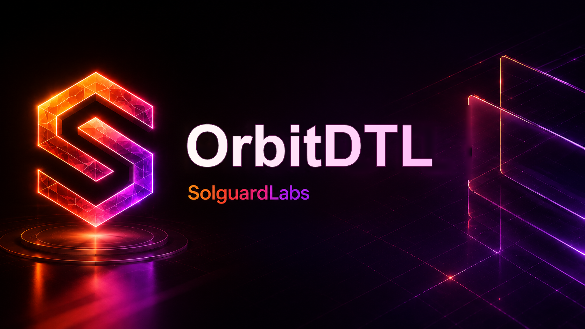

# Orbit DTL



Orbit DTL es un binario Rust que modela una capa de liquidacion y
transferencia diferida para flujos multi-activo. El proyecto simula un entorno
operativo donde participantes, vaults, rutas, sesiones y controles de riesgo
coordinan ordenes de liquidacion con precios de oraculo y contabilizacion de
eventos.

El objetivo del repositorio es ofrecer una base realista para auditoria tecnica
de protocolos de liquidacion. La implementacion prioriza codigo legible,
modularidad y una superficie suficientemente amplia para analizar interacciones
entre contabilidad, pricing, limites de ruta, sesiones y ejecucion final.

## Componentes Principales

- `accounts`: cuentas operativas y saldos por activo.
- `amount`: aritmetica entera, basis points y operaciones de ratio.
- `asset`: registro de activos, decimales y parametros de riesgo.
- `oracle`: cotizacion determinista entre activos.
- `vault`: reservas, bloqueos, pagos y entradas de liquidez.
- `routes`: configuracion de rutas de liquidacion entre vaults.
- `orders`: intents de transferencia y estado de cola.
- `session`: ventanas de liquidacion y registro de counterflow.
- `risk`: limites de exposicion por cuenta, ruta y sesion.
- `ledger`: motor principal de estado, eventos y ejecucion.
- `cli`: interfaz de consola del binario.

## Requisitos

- Rust estable.
- Cargo con soporte para `edition = "2021"`.
- Bun `>= 1.3.0` para ejecutar la suite JavaScript.
- Bash para los scripts de CI locales.

## Uso

Ejecutar el escenario operativo de ejemplo:

```bash
cargo run -- demo
```

Ejecutar el mismo escenario con salida JSON:

```bash
cargo run -- demo --json
```

La salida JSON incluye cuentas, vaults, sesiones y eventos generados durante la
ejecucion. Esta salida se usa tambien como contrato de integracion para los
tests de Node.

## Tests

Ejecutar la suite Rust:

```bash
cargo test --locked
```

Ejecutar la suite Node con Bun:

```bash
bun test --timeout 30000 ./tests/node
```

Ejecutar ambas suites:

```bash
bun run test:all
```

Ejecutar la validacion completa usada por CI:

```bash
bash scripts/ci.sh
```

## Calidad

El flujo de CI valida:

- formato Rust con `cargo fmt`;
- build completo con `cargo build --all-targets`;
- tests Rust con `cargo test`;
- lint Rust con `cargo clippy -D warnings`;
- formato JavaScript con Prettier;
- comprobacion sintactica de helpers JavaScript;
- tests Node con Bun.

Dependabot mantiene actualizaciones para Cargo, npm/Bun y GitHub Actions.

## Estructura

```text
src/
  accounts/
  amount/
  asset/
  cli/
  codec/
  events/
  ids/
  ledger/
  oracle/
  orders/
  risk/
  routes/
  session/
  vault/
tests/
  helpers/
  node/
  rust_cli_demo.rs
scripts/
  ci.sh
  tests.sh
```

## Estado Del Proyecto

Orbit DTL es un laboratorio autocontenido. No requiere servicios externos,
bases de datos ni redes locales para ejecutar el binario o sus tests.
